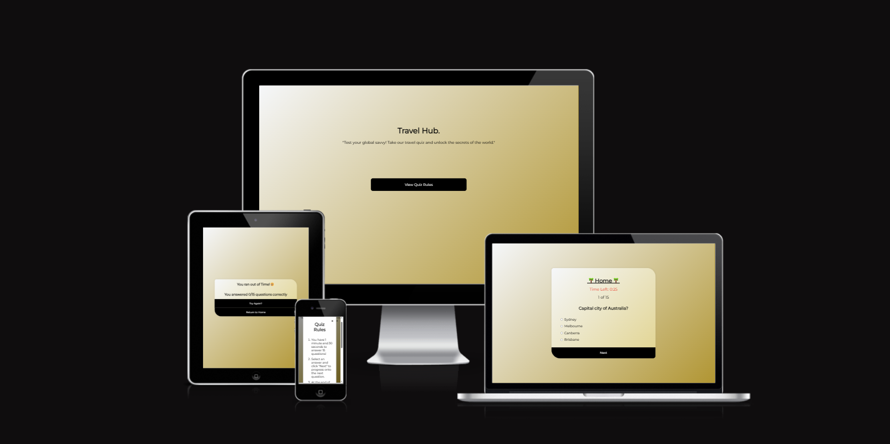

# Welcome to Travel Hub: Test your global savvy with our Travel-Themed Quiz!

## What is Travel Hub?

Travel Hub is more than just a website; it's a virtual destination where you can embark on a quest to test and expand your knowledge about various travel-related topics. Whether you're a globetrotting adventurer or someone dreaming of your next getaway, Travel Hub offers an immersive and educational experience that allows you to explore the world from the comfort of your own screen.

## Project Goals

The purpose behind this project was to open the mind of the user about Travel, testing their knowledge and allowing them to learn along the way whilst being able to have a challenge.

## Travel Hub Site Goals

To inspire all indviduals and give them an unforgettable travel/quiz insight and experience.

## User Goals

The website is aimed at those interested in quizzes and travel. (More information here).[User Stories](#user-stories)

* Avid quizzer looking for a new quiz.
* Avid traveller looking for a fun interactive way to broaden their knowledge and gain travel inspiration.
* Someone completely new to the world of travel and quizzes.

## Research

I conducted alot of online research regarding what other quizzes offer and how user friendly they are. This included color schemes, layout and features. I made notes of what worked well and what didn't work so well.

[Sporcle](https://www.sporcle.com/) | [Fun Trivia](https://www.funtrivia.com/quizzes/) | [BuzzFeed Quizzes](https://www.buzzfeed.com/uk/quizzes)

### Key Takeaways

* Create a clean and concise quiz.
* Website should get straight to the point.
* The colors used should promote happiness with a sense of travel.
* Interactivety is key.
* Keep good contrast so the quiz is easily readable.
* Make everything accesible and easy to navigate.
* Explain what the website is with a concise landing page.