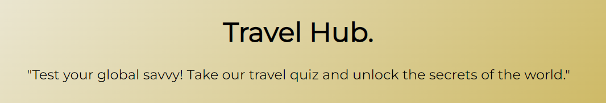
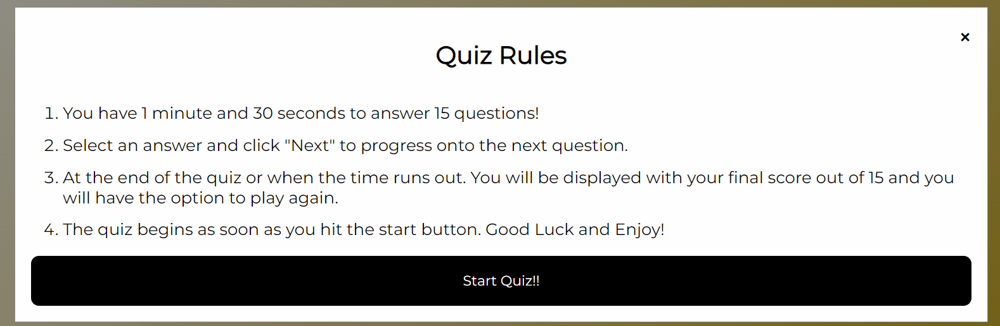
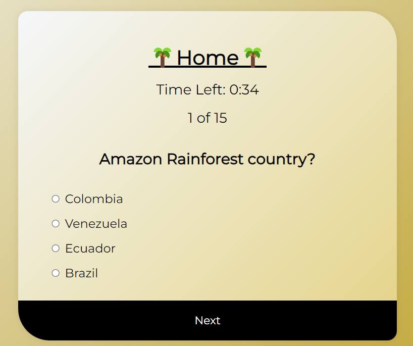
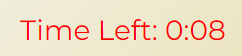

# Welcome to Travel Hub: Test your global savvy with our Travel-Themed Quiz!

## What is Travel Hub?

Travel Hub is more than just a website; it's a virtual destination where you can embark on a quest to test and expand your knowledge about various travel-related topics. Whether you're a globetrotting adventurer or someone dreaming of your next getaway, Travel Hub offers an immersive and educational experience that allows you to explore the world from the comfort of your own screen.

## Project Goals

The purpose behind this project was to open the mind of the user about Travel, testing their knowledge and allowing them to learn along the way whilst being able to have a challenge.

## Travel Hub Site Goals

To inspire all indviduals and give them an unforgettable travel/quiz insight and experience.

## User Goals

The website is aimed at those interested in quizzes and travel. (More information here).[User Stories](#user-stories)

* Avid quizzer looking for a new quiz.
* Avid traveller looking for a fun interactive way to broaden their knowledge and gain travel inspiration.
* Someone completely new to the world of travel and quizzes.

## Research

I conducted alot of online research regarding what other quizzes offer and how user friendly they are. This included color schemes, layout and features. I made notes of what worked well and what didn't work so well.

[Sporcle](https://www.sporcle.com/) | [Fun Trivia](https://www.funtrivia.com/quizzes/) | [BuzzFeed Quizzes](https://www.buzzfeed.com/uk/quizzes)

### Key Takeaways

* Create a clean and concise quiz.
* Website should get straight to the point.
* The colors used should promote happiness with a sense of travel.
* Interactivety is key.
* Keep good contrast so the quiz is easily readable.
* Make everything accesible and easy to navigate.
* Explain what the website is with a concise landing page.

# Features

## Hero Text and Quote

* This appears on the home page.
* It is in large black text to stand out to the user.
* Underneath this is a quote explaining to the user what the site is and in a fun and engaging format.
* The Hero text and Quote is fully responsive from a mobile phone all the way to the largest computer!

## Quiz Modal and Quiz Rules button

* In the centre of the home page underneath the Hero text and Quote sits the "View Quiz Rules" button.
* The button sits in the centre of the page as a black button to provide contrast against the background for ease of visibility.
* The button is fully responsive with the button text stacking and staying within the button when being viewed on mobiles to large computer screens.
* It has been displayed in a button to prompt the user to click it allowing them to see the rules within the modal.
* This modal contains all the rules you need to know before embarking on the Travel Hub quiz!
* The modal sits above all the home page content and can be exited by clicking outside of the modal or the close icon in the top right of the modal.
* I made the background of the modal white with the text being black to allow the user to easily read the rules of the quiz.
* The modal is fully responsive and it contains the start quiz button which follows the same styling and the Quiz Rules button for continuity.
* Once the user has read and understood the rules, the quiz will start immediately and the one minute timer will begin.

## Main Quiz

* The quiz is at the heart of the Travel Hub. The quiz is fully interactive containing many features within.

### Quiz Features

* Home button to return home and leave the quiz to access more features:
* Countdown timer: This timer begins as soon as the user selects "Start Quiz!". It's a race against the clock to answer all 15 questions before the timer hits zero. If this happens the quiz ends and the user will be displayed will their final score. Also when the timer hits 30 seconds the timer changes color to red to indicate there is not much time left!

    

Red Timer

    

    

     
* Question counter: So the user can focus solely on the quiz a question counter has been added to increment from 1 - 15 everytime a question is answered.
* Questions: The quiz contains 15 questions which are randomized everytime the user starts the quiz! These include a variety of challenging questions.
* Answers: Here we have the choices, choose carefully as once you submit there is no going back. The user has the choice of four potential answers.
* Next button: This button can only be selected once an answer has been chosen. 

The above features can be seen in the image of the main quiz.

* Final score and play again button: Once the timer ends or the user has answered all the questions they will be displayed with a final screen which shows their score out of 15 and the option to play again!

As shown above the user is shown the same end screen with slight variations whether they complete the quiz or run out of time. In both instances they are given the same options to play/try again or return home whilst being shown their score out of 15.